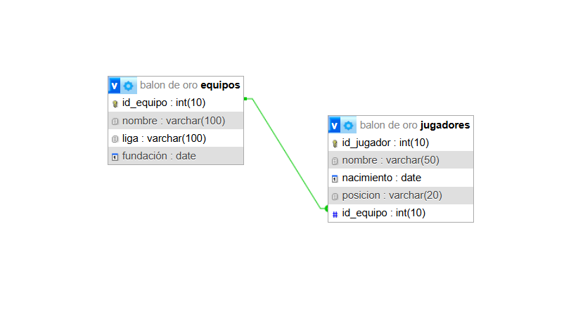

BalonDeOro – Parte 2 (Versión Corregida)

Temática

Proyecto basado en el Balón de Oro 2025 que permite gestionar jugadores, equipos y menciones honoríficas. Incluye vistas con CRUD completo, login seguro para acciones protegidas y una API REST para consultar y manipular menciones con filtros, ordenamiento y paginación.

Correcciones aplicadas (Parte 2)
1. Se agregó la vista de detalle de mención.
2. Se añadió la columna “club” en los formularios y en las vistas.
3. Se corrigieron rutas y el armado de BASE_URL.
4. Se protegieron las acciones importantes con login obligatorio.
5. Se implementó password_hash y password_verify (se quitó la contraseña hardcodeada).

Instalación
1. Clonar repositorio en carpeta "htdocs" de XAMPP.
2. Importar la base desde balon_de_oro.sql o dejar que se autogenere.
3. Iniciar Apache y MySQL.
4. Acceder a http://localhost/BalonDeOro-Web2/

Acceso administrador

Usuario: webadmin  
Contraseña: admin

Integrante:

Leonel Casamayou - leonelcasamayou@gmail.com

Diagrama Entidad-Relación

