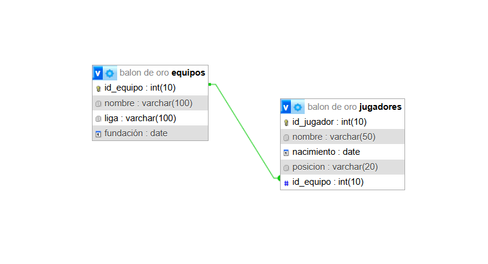

## BalonDeOro-Web2

## Temática: Balón de Oro

Este proyecto se basa en el balón de oro 2025, incluyendo al top 10 *jugadores* del año como a sus respectivos *equipos*, proporcionando información acerca de las entidades.
La entidad-relación se da gracias a la *id_equipo*, la cual vincula ambas tablas.

## Instalación
1. Clonar repositorio en carpeta "htdocs" de XAMPP.
2. Importar la base desde balon_de_oro.sql o dejar que se autogenere.
3. Iniciar Apache y MySQL.
4. Acceder a http://localhost/BalonDeOro-Web2/

## Acceso administrador
Usuario: webadmin  
Contraseña: admin

## Integrante:
Leonel Casamayou - leonelcasamayou@gmail.com

## Diagrama Entidad-Relación

